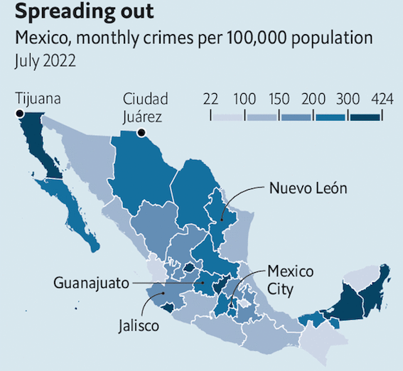

::: {#fig-crimes}

{#fig-crimes width=60% .lightbox fig-align="left"}

Several violent episodes in Mexico suggest a worrying trend   
Source: The Economist

:::

# Introduction

## Spatial Concentration of High Impact Crime in Mexico

This study utilizes the Location Quotient (LQ) methodology to systematically identify and quantify the spatial concentration of High-Impact Crimes across Mexican municipalities, January through October 2025.
We have reduced the research to analyze homicides, in order to establish baseline LQs for the target year.

Findings are anticipated to reveal significant spatial segregation of criminal risk, with certain key urban and border jurisdictions demonstrating LQs significantly greater than 1.0, indicating a severe concentration of high-impact offenses.

The primary objective is to move beyond generalized security strategies by providing policymakers and public security agencies with granular, evidence-based intelligence for targeted resource allocation.

The resulting maps and risk profiles offer a critical foundation for designing preventative interventions, optimizing police deployment, and implementing precision policing strategies to effectively combat concentrated insecurity in Mexico.

## Key Elements

- Problem: Traditional crime rates mask disparity.

- Methodology: Location Quotient (LQ) analysis.

- Focus: High-Impact Homicides in Mexico.

- Timeframe: January through October 2025.

- Key Findings: Significant spatial segregation/concentration (LQ > 1.0) will be revealed.

- Impact: Provides intelligence for targeted resource allocation and precision policing.

## Foundations of Location Quotients

The Location Quotient, primarily developed by economists to study regional specialization and industrial concentration, provides a measure of relative importance.

Hoover (1936) and Isard (1951) are credited with pioneering the concept.
In economics, the LQ for an industry in a region is the ratio of that industry's share of regional employment to its share of national employment.

An LQ greater than 1.0 signifies that the region is specialized in that industry compared to the nation.
This concept is directly translated to crime analysis, replacing 'industry' with 'crime type' and 'employment' with 'crime counts' or 'population.'


# Environment settings

```{python}
import polars as pl
import pandas as pd
import geopandas as gpd
from pathlib import Path
import folium
import folium.plugins as plugins
import warnings
warnings.filterwarnings('ignore')
```

## Datasets

### Homicides

```{python}
homicides = Path('homicides.parquet')

df_homicides = pl.read_parquet(homicides)

df2 = df_homicides.to_pandas().head(10)
```

```{python}
#| label: tbl-homicides
#| tbl-cap: Preview of homicides dataset
(
    df2
        .style.hide(axis='index')
)
```

### Population

```{python}
pop = Path('population.parquet')

df_pop = pl.read_parquet(pop)

df3 = df_pop.to_pandas().head(10)
```

```{python}
#| label: tbl-pop
#| tbl-cap: Preview of population dataset
(
  df3
      .style.hide(axis='index')
)
```


# Methodology and Calculation

The Crime Location Quotient (CLQ) compares a municipality's relative share of homicides with the country's relative share of that same indicator.

The general formula for the Location Quotient is:

$$CL_{h} = \frac{\frac{X_{h,m}}{X_{P,m}}}{\frac{X_{h,T}}{X_{P,T}}}$$

where:

$CL_{h}$​: Location quotient of homicides (h) in the municipality m.   
$X_{h,m}$​: Homicides in the municipality M.   
$X_{P,m​}$: Population in the municipality m.   
$X_{h,T}$​: Averall homicides in Mexico.   
$X_{P,T}$​: Averall population in Mexico.   


## Data Collection for 2025

::: {.callout-note appearance="simple" icon=false style="border-left: 5px solid #e3120b;"}

**Crime Incidence Data**

Required Data: The number of victims of homicide disaggregated by municipality and the national total for the study period (January-October 2025).

Source: SESNSP Open Crime Incidence Data.

:::


::: {.callout-note appearance="simple" icon=false style="border-left: 5px solid #e3120b;"}

**Population Data**

Required Data: The Municipal Population projection for 2025.

Source: CONAPO.

:::


# Results and Analysis

```{python}
# join homicides and population tables
df = (
    df_homicides
        .join(df_pop, on='cve_geo', how='inner')
        .select(['cve_geo','Entidad','Municipio','Homicidios','Pob',])
        .filter(pl.col('Pob')>10_000)
)
```

```{python}
def lq_calculation(df: pl.DataFrame) -> pl.DataFrame:
    """
    Calculates the Location Quotient (LC) of homicides at the municipal level.
    The LC compares the proportion of homicides in the municipality relative to the
    national total with the proportion of the municipality's population relative to
    the national total.

    Args:
        df: Polars DataFrame

    Returns:
        Polars DataFrame with 'CL_homicides' column.
    """
    
    totals = df.select([
        pl.col("Homicidios").sum().alias("Overall_homicidios"),
        pl.col("Pob").sum().alias("Overall_pop")
    ]).row(0)
    
    overall_homicides = totals[0]
    overall_pop = totals[1]

    # CL = [(Homicidios en Municipio/Pob en Municipio) /
    #       (Homicidios Total Nacional/Pob Total Nacional)]
    df_cl = df.with_columns(
        (
            (pl.col("Homicidios") / overall_homicides) / 
            (pl.col("Pob") / overall_pop)
        ).alias("CL_homicides")
    )
    
    return df_cl
```

```{python}
results = (
    lq_calculation(df)
)

df4 = (
    results
        .filter(pl.col('CL_homicides')>1)
        .sort('CL_homicides', descending=True)
        .to_pandas()
        .head(10)
)
```

```{python}
#| label: tbl-combined
#| tbl-cap: Preview of final dataset
(
    df4
        .style.hide(axis='index')
        .format(precision=2, thousands=",", decimal=".")
)
```

```{python}
# geojson file
mexico = gpd.read_parquet('geo.parquet')

# rename columns
mexico = (
    mexico.loc[:, ['CVE_ENT','NOM_ENT','CVE_MUN','NOMGEO','geometry']]
        .rename(columns={'CVE_ENT':'cve_ent',
            'NOM_ENT':'entidad',
            'CVE_MUN':'cve_mun',
            'NOMGEO':'municipio',})
)

# rename state names
mexico['entidad'] = mexico['entidad'].replace({
    'Coahuila de Zaragoza':'Coahuila',
    'Michoacán de Ocampo':'Michoacán',
    'Veracruz de Ignacio de la Llave':'Veracruz',
})

# create cve_geo column
mexico['cve_geo'] = mexico['cve_ent'] + mexico['cve_mun']

# convert to int
mexico['cve_geo'] = mexico['cve_geo'].astype(int)

# concat tables
df_geo = (
    mexico.merge(results.to_pandas(), on='cve_geo', how='left')
    [['cve_geo','Entidad','Municipio','Homicidios','Pob','CL_homicides','geometry']]
)

df_geo_gt1 = df_geo[df_geo['CL_homicides']>1]

# save geojson file
#df_geo_g1.to_file('geo_results.geojson', driver='GeoJSON')
```

```{python}
m = df_geo_gt1.explore(
    location=[24, -104],
    zoom_start=5.4,
    column='CL_homicides',
    tooltip=['Entidad','Municipio','CL_homicides'],
)

fullscreen_plugin = plugins.Fullscreen(
    position="topleft",
    title="Fullscreen",
    title_cancel="Exit",
    force_separate_button=True,
).add_to(m)
```

```{=html}
<div class='tableauPlaceholder' id='viz1765556881772' style='position: relative'><noscript><a href='#'></a></noscript><object class='tableauViz'  style='display:none;'><param name='host_url' value='https%3A%2F%2Fpublic.tableau.com%2F' /> <param name='embed_code_version' value='3' /> <param name='site_root' value='' /><param name='name' value='CrimeLocationQuotient&#47;clq-mexico' /><param name='tabs' value='no' /><param name='toolbar' value='yes' /><param name='static_image' value='https:&#47;&#47;public.tableau.com&#47;static&#47;images&#47;Cr&#47;CrimeLocationQuotient&#47;clq-mexico&#47;1.png' /> <param name='animate_transition' value='yes' /><param name='display_static_image' value='yes' /><param name='display_spinner' value='yes' /><param name='display_overlay' value='yes' /><param name='display_count' value='yes' /><param name='language' value='es-ES' /></object></div>                <script type='text/javascript'>                    var divElement = document.getElementById('viz1765556881772');                    var vizElement = divElement.getElementsByTagName('object')[0];                    if ( divElement.offsetWidth > 800 ) { vizElement.style.minWidth='420px';vizElement.style.maxWidth='1200px';vizElement.style.width='100%';vizElement.style.minHeight='587px';vizElement.style.maxHeight='877px';vizElement.style.height=(divElement.offsetWidth*0.75)+'px';} else if ( divElement.offsetWidth > 500 ) { vizElement.style.minWidth='420px';vizElement.style.maxWidth='1200px';vizElement.style.width='100%';vizElement.style.minHeight='587px';vizElement.style.maxHeight='877px';vizElement.style.height=(divElement.offsetWidth*0.75)+'px';} else { vizElement.style.width='100%';vizElement.style.height='727px';}                     var scriptElement = document.createElement('script');                    scriptElement.src = 'https://public.tableau.com/javascripts/api/viz_v1.js';                    vizElement.parentNode.insertBefore(scriptElement, vizElement);                </script>
```


# Policy Implications

The application of Location Quotient (LQ) methodology to crime analysis is a specialized area within spatial criminology, drawing heavily on its original use in economic geography.

The literature establishes LQ as a powerful tool for moving beyond simple crime rates to identify areas where specific criminal activity is disproportionately concentrated.

# References

::: {#refs}
:::


# Contact

::: {style="color: #004761; font-size: 28px; font-weight: bold; margin-top: 10px; margin-bottom: 0px;"}
Jesus L. Monroy
:::

::: {style="color: #00a398; font-size: 20px; font-style: italic; font-family: 'ITC Charter', Georgia, serif; margin-top: 0px;"}
Economist & Data Scientist
:::

::: {style="color: #4b4f54; font-size: 16px; font-style:italic; font-family: 'ITC Charter', Georgia, serif; width: 60%; text-align: justify; line-height: 1.5; margin-top: 0px; margin-bottom: 15px;"}

Passionate about creating tools that make data accessible and impactful using SQL, Python, Streamlit, Shiny and Tableau in diverse sectors like Public Security, e-commerce, and Healthcare.     
BA in Economics, MA in Information Technology, and Data Science and Machine Learning certification.
:::

::: {style="font-size: 15px; font-family: sans-serif;"}
[Portfolio](https://jesuslm-my-website.share.connect.posit.cloud) | 
[Linkedin](https://www.linkedin.com/in/j3sus-lm) | 
[Twitter](https://x.com/j3suslm) | 
[Tableau](https://tinyurl.com/jesuslm-tableau)
:::

```{=html}
<iframe 
    src="https://jlm-contact-form.streamlit.app/?embed=true"
    style="width:90%; height:680px; border:none; transform:scale(0.9); transform-origin:0 0;"
    data-external="1" 
    title="Contact Form">
</iframe>
```
