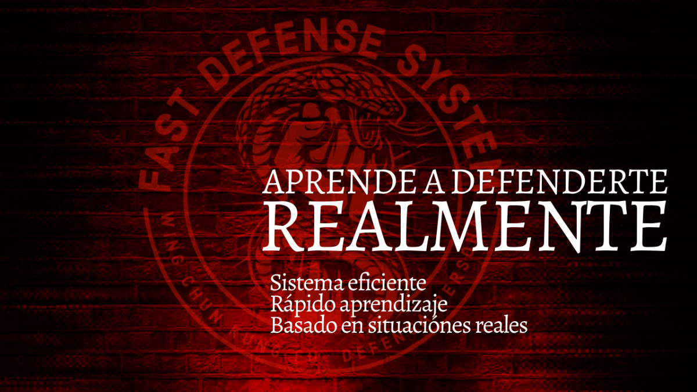
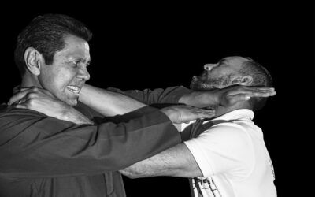

{.lightbox fig-align="left" width="90%"}

## Martin Arzate

**Director general**  
**Fundador de Fast Defense System** 

Inicia su entrenamiento de Wing Chun en 1985 en el Puerto de Acapulco, Guerrero con el Prof. Rodolfo Álvares. (QEPD †)

* 1990 – 1996

Entrena Jeet Kune Do en la Academia IMB en el Puerto de Acapulco, representada por el profesor Rodolfo Álvares Ayvar,donde entrenó diversas disciplinas de Artes Marciales como Boxeo, Muay Thai, Kali Filipino, Jeet Kune Do. Durante este tiempo, participó en diversos seminarios de Jeet Kune con el Maestro Richard Bustillo, Co-fundador de la IMB (INTERNATIONAL MARTIAL ARTS & BOXING)

* 1996 – 2000

Entrenó con Sifu Abram Ghandy Yuaza, Fundador de la Asociación Nacional de Hok Hok Pai y Asociación Nacional de VingTsun Moy Yat.

* 2000 – 2010

Entrenó con Sifu Emin Boztepe.

Ha practicado diversos sistemas de Artes Marciales aparte del WingChun, como Boxeo, Kali, Kuntao Silat, Jiu-jitsu, Sambo y judo, así como kick boxing. Sus entrenamientos los ha llevado a cabo en México y USA. (Los Angeles, Miami, Las Vegas)

Ha participado en diversos programas de  televisión:

* Hoy, Se vale, TeleHit, Canal 11, y un gran número de reportajes de medios impresos y radio.

Ha impartido varios seminarios de VingTzun y defensa personal en diversas ciudades del país.

Ha sido Instructor de escoltas  y grupos de seguridad élite.

Creador de los programas de FAST DEFENSE SYSTEM Defensa Personal para el Mundo Real

**CERTIFICACIONES EN MEDICINA CHINA Y TERAPIAS ALTERNATIVAS**

Título de “Quirofísico” con especialidad en Hidroterapia, Quiropráctico y Masajes. (Sueco, drenaje linfático, deportivo, shiatsu, reductivo)

- Especialidad de asesor en herbolaria.
- Ventosas y Moxibustión
- Certificación en Auriculo-puntura
- Digito Presión
- Reflexología
- Maestría en Reiki Usui Tibetano
- Certificación en Ajuste- Biomagnético 
- Certificación en terapia neural
- Certificación en manejo de emociones

 

**Contacto**

::: {.link-container .nav-links}
 [Celular]("tel:+5530283342")
 [Twitter](https://x.com)
 [Tiktok](https://www.tiktok.com)
 [YouTube](https://www.youtube.com)
:::

## Alejandro Nava

**Instructor**

Más de 10 años practicando el arte marcial Wing Tsun de la mano de Sifu Martin Arzate.

En 2025 obtuvo el grado de Sifu.

| Día  | Horario  |
|--------|--------|
| Lunes  | 18:00-20:00 |
| Martes  | 18:00-20:00 |
| Miercoles | 18:00-20:00 |
| Jueves | 18:00-20:00 |
| Viernes | 18:00-20:00 |
| Sabado | 10:00-12:00 |
| Domingo | 10:00-12:00 |

: Horarios disponibles {.striped .hover}

 

**Contacto**

::: {.link-container .nav-links}
 [Celular]("tel:+5530283342")
 [Twitter](https://x.com)
 [Tiktok](https://www.tiktok.com)
 [YouTube](https://www.youtube.com)
:::

## Jesús López

**Instructor**

Más de 10 años practicando el arte marcial Wing Tsun de la mano de Sifu Martin Arzate.

En 2025 obtuvo el grado de Sifu.

| Día  | Horario  |
|--------|--------|
| Sabado | 10:00-12:00 |
| Domingo | 10:00-12:00 |

: Horarios disponibles {.striped .hover}

 

**Contacto**

::: {.link-container .nav-links}
 [Celular]("tel:+5530283342")
 [Twitter](https://x.com)
 [Tiktok](https://www.tiktok.com)
 [YouTube](https://www.youtube.com)
:::
