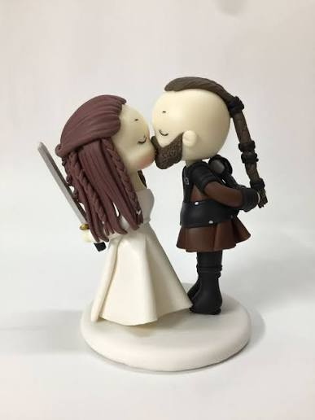

::: {.hero-title}
Luis Enrique Contreras Rosas <br> & <br> Citlalin Mayo Hernández
:::

::: {.hero-subtitle}
Septiembre 12, 2026 

• Calle Sierra Verde Himalaya 86, Col. Ampliación Benito Juárez, <br> Naucalpan, Estado de México
:::


::: {#fig-viking style="text-align: center;"}

{fig-align="center" width="50%" .rounded .lightbox}

Boda Vikinga

:::


# Nuestra Historia

::: {.justify}
Nos conocimos hace 10 años en una fresca tarde de otoño en Naucalpan.
Lo que empezó como una simple charla tomando un café se convirtió en horas de historias compartidas, aventuras constantes y un compromiso para toda la vida.

¡Estamos deseando celebrar el comienzo de nuestra nueva etapa con nuestros amigos y familiares más cercanos!
:::


# Días Faltantes

```{python}
#| label: countdown-timer
#| echo: false

from datetime import date
from IPython.display import HTML

wedding_date = date(2026, 10, 18)
today = date.today()
days_remaining = (wedding_date - today).days

if days_remaining > 0:
    display_html = f"""
    <div class="countdown-box">
        <h2 style="margin:0; font-size:3rem; color:#5a6b5c;">{days_remaining}</h2>
        <p style="margin:0; font-size:1.1rem; color:#666;">Días faltantes hasta que digamos "Acepto"</p>
    </div>
    """
elif days_remaining == 0:
    display_html = """
    <div class="countdown-box">
        <h2 style="margin:0; font-size:2.5rem; color:#5a6b5c;">¡Hoy es el Día! 🎉</h2>
    </div>
    """
else:
    display_html = """
    <div class="countdown-box">
        <h2 style="margin:0; font-size:2.5rem; color:#5a6b5c;">Y vivieron felices para siempre💕</h2>
    </div>
    """

HTML(display_html)
```

# Detalles de la Ceremonia


| Hora | Evento |
| :--- | :--- | :--- |
| **3:30 PM** | Recepción de invitados |
| **4:00 PM** | Ceremonia |
| **5:00 PM** | Cocktail |
| **6:30 PM** | Cena & Baile |


# Ubicación

```{python}
import folium

# Center map
venue_coords = [19.4407, -99.2616]
m = folium.Map(location=venue_coords, zoom_start=16, tiles="OpenStreetMap")

folium.Marker(
    location=venue_coords,
    popup="Boda E&C",
    tooltip="Ceremonia y Recepción",
    icon=folium.Icon(color="red", icon="heart", prefix="fa")
).add_to(m)

m
```

--- 

[*Esta página es regalo de la Familia López Mayo*]{.smallcaps}
